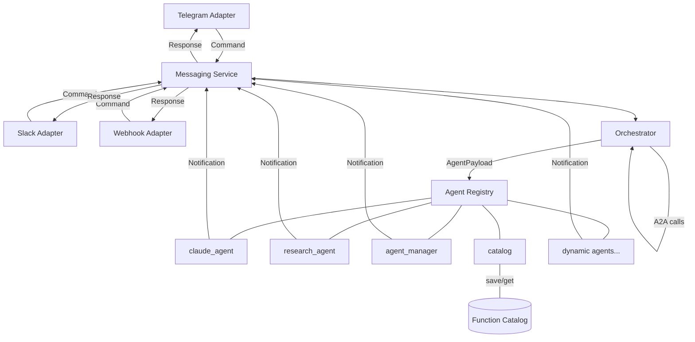
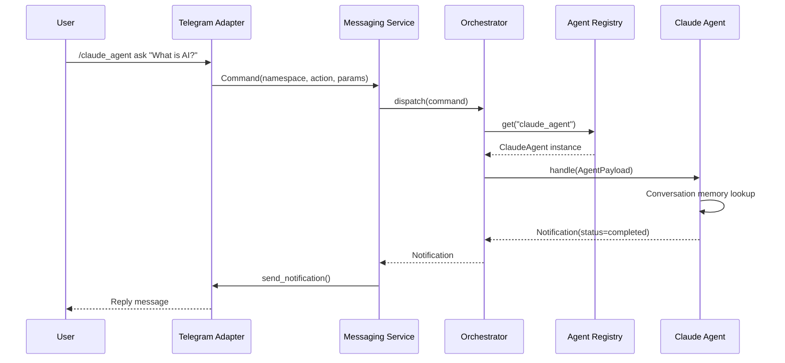
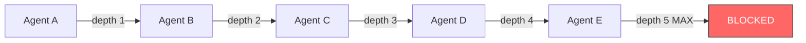

# Multi-Agent Messaging & Orchestration POC

A namespace-routed messaging pipeline that decouples front-end channels (Telegram, Slack, Webhooks) from backend autonomous agents. One entry point routes commands to specialized agents and delivers async responses back to users.

## What Makes This Unique

Most frameworks solve one problem — LangChain does LLM orchestration, Slack Bolt does channel integration. This system does both, and adds runtime agent creation from chat:

- **Channel-agnostic + agent-agnostic** in a single pipeline
- **Create agents from Telegram** — no code deployment needed
- **Agent-to-Agent (A2A) communication** through the same orchestrator users interact with
- **LLM agents, template agents, and dynamic agents** all share the same registry and routing
- **Conversation memory** — Claude remembers context across messages per user
- **Function Catalog** — save, browse, search, and tag reusable function definitions from chat
- **Admin security** — restrict who can create/modify agents in production

## Prerequisites

| Requirement | Version | Notes |
|---|---|---|
| Python | 3.10+ | Uses `match` statements, `X \| Y` unions |
| pip | latest | `pip install -r requirements.txt` |
| Telegram Bot | — | Token from [@BotFather](https://t.me/BotFather) |
| Anthropic API Key | — | From [Anthropic Console](https://console.anthropic.com/) (for Claude agent) |
| Docker (optional) | 20+ | For containerized deployment |

## Architecture



### Request Lifecycle



## Quick Start

### GitHub Codespaces (recommended)

1. Add secrets in GitHub (Settings → Codespaces → Secrets):
   - `TELEGRAM_BOT_TOKEN` — from [@BotFather](https://t.me/BotFather)
   - `ANTHROPIC_API_KEY` — from [Anthropic Console](https://console.anthropic.com/)
2. Open the repo on GitHub, click **Code → Codespaces → Create codespace**
3. Create `.env` from your secrets:
   ```bash
   echo "TELEGRAM_BOT_TOKEN=$TELEGRAM_BOT_TOKEN" > .env
   echo "ANTHROPIC_API_KEY=$ANTHROPIC_API_KEY" >> .env
   ```
4. Run:
   ```bash
   python src/telegram_poll.py
   ```

### Local (Windows PowerShell)

```powershell
git clone https://github.com/jeff0926/AI-messaging-dervis.git
cd AI-messaging-dervis
pip install -r requirements.txt
cp .env.example .env
# Edit .env with your tokens
python -m uvicorn src.app:app --host 127.0.0.1 --port 8000
```

For Telegram polling (no public URL needed):
```powershell
python src/telegram_poll.py
```

### Local (Mac/Linux)

```bash
git clone https://github.com/jeff0926/AI-messaging-dervis.git
cd AI-messaging-dervis
pip install -r requirements.txt
cp .env.example .env
# Edit .env with your tokens
python src/telegram_poll.py
```

### Docker

```bash
cp .env.example .env
# Edit .env with your tokens
docker-compose up --build
```

## Configuration

Copy `.env.example` to `.env` and fill in:

| Variable | Required | Description |
|---|---|---|
| `TELEGRAM_BOT_TOKEN` | Yes (for Telegram) | Token from [@BotFather](https://t.me/BotFather) |
| `ANTHROPIC_API_KEY` | Yes (for Claude agent) | Key from [Anthropic Console](https://console.anthropic.com/) |
| `ADMIN_USER_IDS` | No | Comma-separated Telegram user IDs for admin access (see [Security](#security)) |
| `SLACK_BOT_TOKEN` | No | Slack Bot OAuth token |
| `SLACK_SIGNING_SECRET` | No | Slack app signing secret |
| `API_KEY` | No | API key for webhook auth |
| `HOST` | No | Server bind host (default: `0.0.0.0`) |
| `PORT` | No | Server bind port (default: `8000`) |

## Built-in Agents

### claude_agent — AI-Powered Assistant

Uses the Claude API for intelligent responses. The `ask` action maintains **per-user conversation memory** — Claude remembers context across messages. Use `clear` to reset.

| Action | Use Case | Example |
|---|---|---|
| `ask` | General Q&A with conversation memory | `/claude_agent ask "What causes inflation?"` |
| `code` | Code generation with explanations | `/claude_agent code "Write a Python function to merge two sorted lists"` |
| `summarize` | Condense long text into key bullet points | `/claude_agent summarize "Paste a long article or paragraph here"` |
| `analyze` | Deep analysis with multiple perspectives | `/claude_agent analyze "Impact of remote work on productivity"` |
| `clear` | Reset conversation history | `/claude_agent clear` |

**Conversation Memory**: The `ask` action stores the last 20 messages per user per channel. Claude sees the full conversation history, so follow-up questions like "Can you explain that further?" work naturally. Other actions (`code`, `summarize`, `analyze`) are stateless — each call is independent.

### research_agent — Autonomous Research

Template-based research and summarization agent.

| Action | Use Case | Example |
|---|---|---|
| `run_autonomous_research` | Kick off a full research task on any topic | `/research_agent run_autonomous_research "Quantum Computing"` |
| `summarize` | Quick summary of provided text | `/research_agent summarize "Your text here"` |

### agent_manager — Create & Manage Agents from Chat

Spin up new agents, add actions, and manage them — all from Telegram. No code required.

| Action | Use Case | Example |
|---|---|---|
| `create` | Spin up a new custom agent on the fly | `/agent_manager create my_bot "A helpful bot"` |
| `add_action` | Teach your agent a new command with a response template | `/agent_manager add_action my_bot:greet "Hello {query}!"` |
| `list` | See all agents and their available commands | `/agent_manager list` |
| `info` | See details about a specific agent | `/agent_manager info my_bot` |
| `remove_action` | Remove a command from a custom agent | `/agent_manager remove_action my_bot:greet` |
| `delete` | Delete a custom agent entirely | `/agent_manager delete my_bot` |
| `help` | Show agent manager usage guide | `/agent_manager help` |

**Example: Create a bot in 30 seconds from Telegram:**
```
/agent_manager create my_bot "My first custom bot"
/agent_manager add_action my_bot:greet "Hello {query}! Welcome aboard."
/agent_manager add_action my_bot:joke "Why did {query} cross the road? To get to the other side!"
/my_bot greet "World"           → "Hello World! Welcome aboard."
/my_bot joke "the chicken"      → "Why did the chicken cross the road? To get to the other side!"
```

Custom agents persist to `data/agents/` as JSON and survive restarts.

### catalog — Function Catalog

Save, browse, search, and manage reusable function definitions. This is the building block library for composing agents from modular pieces.

| Action | Use Case | Example |
|---|---|---|
| `save` | Save a reusable function to the catalog | `/catalog save find_trending "Search trending topics for a subject"` |
| `list` | Browse all functions in the catalog | `/catalog list` |
| `info` | View details and source for a specific function | `/catalog info find_trending` |
| `search` | Search functions by name, description, or tag | `/catalog search research` |
| `tag` | Add searchable tags to a function | `/catalog tag find_trending research trends social` |
| `delete` | Remove a function from the catalog | `/catalog delete find_trending` |
| `help` | Show catalog usage guide | `/catalog help` |

**Example: Build a function library from chat:**
```
/catalog save find_trending "Search trending topics for a subject area"
/catalog save get_topic_details "Get description and details for a topic"
/catalog save find_social_handles "Find social media handles and URLs for a topic"
/catalog tag find_trending research trends
/catalog tag find_social_handles social media
/catalog search research    → shows find_trending
/catalog list               → shows all 3 functions
```

Functions persist to `data/functions/` as JSON and survive restarts.

### Telegram Quick Commands

| Command | What it does |
|---|---|
| `/help` | Show all agents with examples and use cases |
| `/start` | Same as /help |
| `/agent_manager list` | List all agents and their actions |

## Security

### Admin-Only Agent Management

By default, the agent manager is **open mode** — any user can create/delete agents. For production, restrict write operations to specific users:

```env
# .env — comma-separated Telegram user IDs
ADMIN_USER_IDS=123456789,987654321
```

| Operation | Requires Admin |
|---|---|
| `create`, `delete`, `add_action`, `remove_action` | Yes (when `ADMIN_USER_IDS` is set) |
| `list`, `info`, `help` | No (always public) |

**How to find your Telegram user ID:** Send a message to [@userinfobot](https://t.me/userinfobot) on Telegram.

### API Key Authentication

Set `AUTH_ENABLED=true` and `API_KEY=your-secret` in `.env`. Protected endpoints require an `X-API-Key` header. Public paths (`/health`, `/agents`) and channel webhooks (Telegram, Slack) are excluded.

## Agent-to-Agent (A2A) Communication

Agents can call other agents through the orchestrator:

```python
result = await self.call_agent(
    target_namespace="claude_agent",
    action="summarize",
    parameters={"query": "Text to summarize"},
    parent_payload=payload,  # preserves context chain
)
```

### Depth Guard

A2A calls track call depth to prevent infinite loops. The maximum depth is **5** (`A2A_MAX_DEPTH`). If an agent chain exceeds this limit, the call fails with a clear error message. This protects against circular dependencies (e.g., Agent A calls Agent B which calls Agent A).



## Adding a New Agent

### Option 1: From Telegram (no code)

```
/agent_manager create weather_bot "Reports weather for any city"
/agent_manager add_action weather_bot:forecast "The forecast for {query} is sunny with a high of 72F"
/weather_bot forecast "San Francisco"
```

### Option 2: Using the @action decorator (recommended)

```python
from src.agents.base import BaseAgent
from src.agents.decorators import action
from src.schemas import AgentPayload, Notification, NotificationStatus

class MyAgent(BaseAgent):
    namespace = "my_agent"

    @action(description="Greet someone by name")
    async def greet(self, payload: AgentPayload) -> Notification:
        name = payload.payload.get("query", "World")
        return Notification(
            task_id=payload.task_id, command_id=payload.command_id,
            status=NotificationStatus.COMPLETED,
            target_channel=payload.context.get("source_channel", "unknown"),
            target_user_id=payload.context.get("user_id", "unknown"),
            data={"chat_id": payload.context.get("metadata", {}).get("chat_id")},
            message=f"Hello, {name}!",
        )

    @action(name="search", description="Run a web search")
    async def _internal_search(self, payload: AgentPayload) -> Notification:
        query = payload.payload.get("query", "")
        # ... your logic ...

    async def handle(self, payload: AgentPayload) -> Notification:
        handler = self.get_action_handler(payload.action)
        if handler:
            return await handler(payload)
        return Notification(
            task_id=payload.task_id, command_id=payload.command_id,
            status=NotificationStatus.FAILED,
            target_channel=payload.context.get("source_channel", "unknown"),
            target_user_id=payload.context.get("user_id", "unknown"),
            message=f"Unknown action: {payload.action}",
        )
```

The `@action` decorator:
- Auto-discovers actions via `capabilities()` and `describe()`
- Supports custom names: `@action(name="search")` exposes `_internal_search` as `search`
- Adds descriptions that show up in `/agent_manager info`
- Coexists with the `action_*` naming convention

### Option 3: action_* prefix convention

```python
class MyAgent(BaseAgent):
    namespace = "my_agent"

    async def handle(self, payload: AgentPayload) -> Notification:
        action = getattr(self, f"action_{payload.action}", None)
        if not action:
            return Notification(...)
        return await action(payload)

    async def action_hello(self, payload: AgentPayload) -> Notification:
        name = payload.payload.get("query", "World")
        return Notification(...)
```

Register in `src/telegram_poll.py` or `src/app.py`:

```python
from src.agents.my_agent import MyAgent
registry.register(MyAgent())
```

## Adding a New Channel Adapter

Implement `BaseChannelAdapter`:

```python
from src.adapters.base import BaseChannelAdapter
from src.schemas import Command, Notification

class DiscordAdapter(BaseChannelAdapter):
    channel_name = "discord"

    async def parse_incoming(self, raw: dict) -> Command:
        # Transform Discord payload → Command
        ...

    async def send_notification(self, notification: Notification) -> None:
        # Transform Notification → Discord message and send
        ...
```

Register in `src/app.py`:

```python
messaging.register_adapter(DiscordAdapter(token="..."))
```

## Webhook API

```bash
# Health check
curl http://localhost:8000/health

# List all agents and capabilities
curl http://localhost:8000/agents

# Send a command
curl -X POST http://localhost:8000/webhook/webhook \
  -H "Content-Type: application/json" \
  -H "X-API-Key: your-api-key" \
  -d '{"user_id":"test","namespace":"claude_agent","action":"ask","parameters":{"query":"What is AI?"}}'

# Check background tasks
curl http://localhost:8000/tasks
curl http://localhost:8000/tasks/{task_id}
```

### Slack Integration

1. Create a Slack app at https://api.slack.com/apps
2. Add Bot Token Scopes: `chat:write`, `commands`
3. Set the request URL to `http://your-host:8000/webhook/slack`
4. Add `SLACK_BOT_TOKEN` and `SLACK_SIGNING_SECRET` to `.env`

Commands work the same way across all channels:
```
/research_agent run_autonomous_research "Quantum Computing"
```

## Stateful vs Stateless

| Component | State | Details |
|---|---|---|
| `claude_agent` `ask` action | **Stateful** | Per-user conversation memory (in-memory, last 20 messages) |
| `claude_agent` other actions | Stateless | Each call is independent |
| Dynamic agents | **Persisted** | Saved as JSON in `data/agents/`, survives restarts |
| Function Catalog | **Persisted** | Saved as JSON in `data/functions/`, survives restarts |
| Conversation memory | In-memory | Lost on restart (swap to Redis/DB for production) |
| Agent Registry | In-memory | Rebuilt on startup from code + saved JSON files |

## Project Structure

```
src/
├── schemas/                   # Data models (Pydantic v2)
│   ├── command.py             # Incoming request from any channel
│   ├── agent_payload.py       # Orchestrator → Agent payload
│   └── notification.py        # Agent → User response
├── agents/
│   ├── base.py                # BaseAgent ABC + A2A call_agent() + action discovery
│   ├── decorators.py          # @action decorator for declarative action authoring
│   ├── registry.py            # Namespace → Agent lookup + orchestrator wiring
│   ├── research_agent.py      # Research agent (template-based)
│   ├── claude_agent.py        # Claude API agent with conversation memory
│   ├── dynamic_agent.py       # Runtime-created agents with template responses
│   ├── agent_manager.py       # CRUD agents from chat + admin security
│   └── catalog_manager.py     # Function catalog management from chat
├── adapters/
│   ├── base.py                # BaseChannelAdapter abstract class
│   ├── telegram.py            # Telegram Bot API (parse + send)
│   ├── webhook.py             # Generic JSON webhook (pass-through)
│   └── slack.py               # Slack Events API + slash commands
├── services/
│   ├── orchestrator.py        # Namespace routing + A2A dispatch + depth guard
│   ├── messaging.py           # Adapter ↔ Orchestrator bridge
│   ├── conversation.py        # Per-user conversation memory store
│   ├── function_catalog.py    # Persistent function catalog (save/search/tag)
│   └── task_queue.py          # Async background task runner
├── middleware/
│   └── auth.py                # API key authentication
├── app.py                     # FastAPI server (webhook mode)
└── telegram_poll.py           # Telegram polling (no ngrok needed)
tests/                         # 81 tests covering all components
config/
data/agents/                   # Persisted dynamic agents (JSON)
data/functions/                # Persisted function catalog (JSON)
```

## Data Flow

### Three schemas drive the entire pipeline:

| Schema | Purpose | Fields |
|---|---|---|
| **Command** | Incoming user request (channel-agnostic) | user_id, namespace, action, parameters, metadata |
| **AgentPayload** | What the orchestrator sends to an agent | task_id, command_id, payload, context |
| **Notification** | What agents send back to the user | status, message, media, data, transformation_hints |

## Running Tests

```bash
python -m pytest tests/ -v
```

81 tests covering schemas, registry, pipeline, Telegram adapter, A2A communication, A2A depth guard, admin security, conversation memory, @action decorator, function catalog, auth middleware, and async task queue.

## License

MIT
